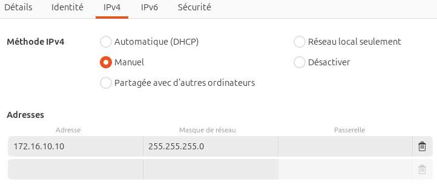
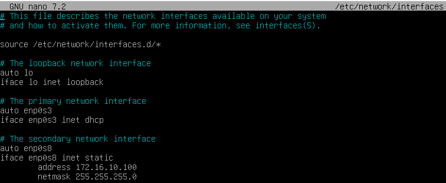
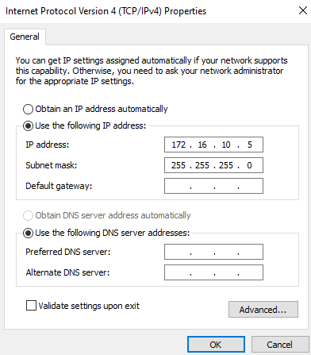
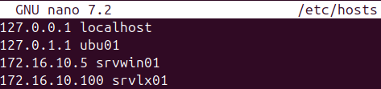
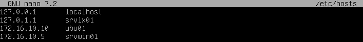
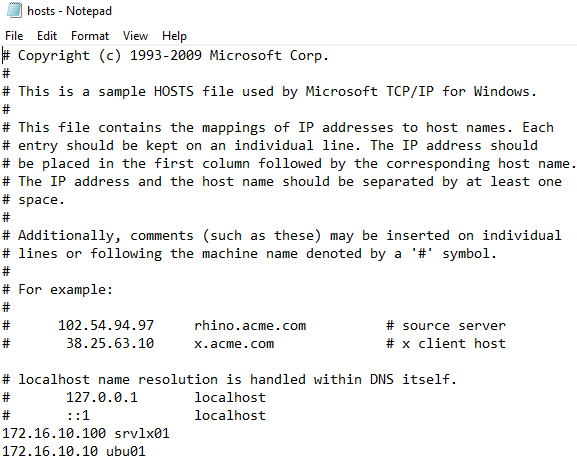
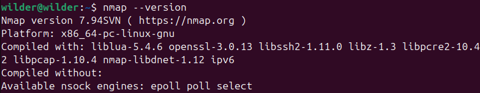

## Sommaire

### 1. [Prérequis technique](#prerequis-technique)  
   1.1 [Update et upgrade](#Update-et-upgrade)  
   1.2 [Paramétrage des IP](#Paramétrage-des-IP)  
         1.2.a [Client Ubuntu](#ubuntu)  
         1.2.b [Serveur Debian](#Serveur-Debian)  
         1.2.c [Windows Serveur 2022](#Windows-Serveur-2022)
      
   1.3 [Paramétrage du réseau](#Paramétrage-du-réseau)  
         1.3.a [Client Ubuntu](#ubuntu)  
      1.3.a Sous-sous-élément 2.1.2  
         1.3.b [Serveur Debian](#Serveur-Debian)  
         1.3.c [Windows Serveur 2022](#Windows-Serveur-2022)
### 2. [Installation sur le client](#installation-sur-le-client)  
   2.1 [Nmap](#Nmap)  
   2.2 [Netcat](#Netcat)  
### 3. [FAQ](#faq)

### 1. Prérequis techniques
<span id="prerequis-techniques"></span>
  #### 1.1 Update et upgrade  

Avant toute chose, vérifiez que vous êtes sous la dernière version disponible. Pour cela, rien de plus simple, il suffit d'entrer ces deux commandes :
``` sudo apt update ```
``` sudo apt upgrade ```

Vous êtes désormais à jour. 

  
  #### 1.2 Paramétrage des IP  
   ##### 1.2.a Client Ubuntu  

D'abord, paramétrons le client. Ici, nous utilisons la version Ubuntu 24.04.2 LTS. Vous pouvez le vérifier avec la commande
``` lsb_release -a ```

Nous allons dans les Paramètres; dans la rubrique Réseau; puis dans les options du réseau qui nous intéresse : Ethernet enp0s8. Il est possible d'y voir vos cartes réseau avec la commande 
``` ip -a ```

Dans la rubrique IPv4, nous allons insérer une adresse IP et un masque. Dans notre cas, nous choisirons 172.16.10.10 et 255.255.255.0. Ce qui devrait donner ceci :  

  
   ##### 1.2.b Serveur Debian  
         
Ici, le plus simple est de se connecter directement avec le compte root.  
Ensuite, modifions le fichier /etc/network/interfaces avec la commande ```nano /etc/network/interfaces```  
Configurez votre seconde carte réseau de la façon suivante :

  

Nous avons changé le "allow hotplug" en "auto" par mesure de précaution. Cela signalera d'activer la carte au branchement de celle-ci. enp0s8 étant le nom de la carte réseau, et également "dhcp" en "static" pour signaler une configuration manuelle. Une fois fait, vous pouvez enregistrer et quitter le fichier.
   ##### 1.2.c Windows Serveur 2022  

Enchaînons avec le Windows serveur. Dans Server Manager, allons dans la rubrique Local Server, puis cliquons sur l'extralien de Ethernet 2. Allons dans les propriétés d'Ethernet 2 (click droit, Properties). Puis dans Internet Protocol Version 4 (TCP/IPv4). C'est ici que nous insérons l'addresse IP et le masque. Le résultat suivant est ainsi obtenu :

  

  #### 3. Paramétrage du réseau  
   ##### 1.3.a Client Ubuntu  

Maintenant, établissons la connexion entre les machines. Pour cela, nous allons modifier le fichier /etc/hosts et y ajouter les adresses IP et les noms de machines correspondant. Pour cela, tapez la commande ```sudo nano /etc/hosts```. Dans notre cas, voici le résultat :

 

   ##### 1.3.b Serveur Debian  
Nous allons procéder à la même chose sur le serveur Debian. Pour cela, même commande (le sudo n'est pas nécessaire si vous êtes sur le compte root) ```nano /etc/hosts```  
VOus pouvez maintenant ajouter les adresses IP des machines de votre futur réseau. 

  
   ##### 1.3.c Windows Serveur 2022  
Nous allons maintenant le faire sur le serveur Windows. Dans l'explorateur de fichiers, nous allons suivre le chemin suivant : C:\Windows\System32\drivers\etc pour ouvrir le fichier hosts. Ajoutons-y les adresses IP des autres machines :

 

### 2. Installation sur le client  
<span id="installation-sur-le-client"></span>

 #### 2.1 Nmap  
      
Nmap a été initialement créé pour fonctionner sur les systèmes d’exploitation GNU/Linux. Ainsi, vous le trouverez dans tous les dépôts de paquets officiels des distributions Unix.
Afin de vérifier que Nmap est bien présent dans vos dépôts de paquets, vous pouvez utiliser la commande suivante :  
``` sudo apt search ^nmap$  ```

Le paquet étant disponible, il est donc possible de l'installer avec la commande :
```sudo apt install nmap ```

Enfin, pour vérifier que nmap ait bien été installé, il est possible de le vérifier en demandant sa version installée, que vous pouvez demander ainsi :
```nmap --version ```

Voici la sortie standart obtenue. Par la même occasion, la version 7.94SVN de Nmap sera celle utilisée tout au long des documents.

 

  #### 2.2 Netcat

L'installation de netcat se fait comme suit :
``` sudo apt install netcat-openbsd ```

Voilà, tout est installé. Vous pouvez désormais commencer à effectuer vos premiers scans de ports.
